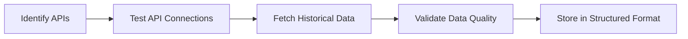

# Bangladesh External Debt Analysis Plan

## Project Overview
Investigate why Bangladesh has accumulated significant external debt and identify potential solutions through data-driven analysis.

## Focus Area
**External Debt**: Loans from international organizations (IMF, World Bank, ADB) and foreign governments

---

## Data Sources

### Primary Sources

#### 1. World Bank API
- **Endpoint**: `https://api.worldbank.org/v2/country/BGD/indicator/{indicator}`
- **Key Indicators**:
  - `DT.DOD.DECT.CD` - External debt stocks, total (current US$)
  - `DT.DOD.MLAT.CD` - Multilateral debt (IMF, World Bank, ADB)
  - `DT.DOD.BLAT.CD` - Bilateral debt (government-to-government)
  - `DT.DOD.PRVT.CD` - Private creditors debt
  - `DT.AMT.DLXF.CD` - Principal repayments on external debt
  - `DT.INT.DLXF.CD` - Interest payments on external debt
  - `DT.TDS.DECT.CD` - Total debt service on external debt

#### 2. IMF API
- **Endpoint**: `http://dataservices.imf.org/REST/SDMX_JSON.svc/`
- **Datasets**:
  - International Financial Statistics (IFS)
  - Balance of Payments (BOP)
  - Government Finance Statistics (GFS)

#### 3. Asian Development Bank (ADB)
- **Source**: ADB Data Library
- **Focus**: Regional development loans and grants to Bangladesh

### Complementary Economic Indicators

#### From World Bank API:
- `NY.GDP.MKTP.CD` - GDP (current US$)
- `NY.GDP.MKTP.KD.ZG` - GDP growth (annual %)
- `NE.EXP.GNFS.CD` - Exports of goods and services
- `NE.IMP.GNFS.CD` - Imports of goods and services
- `FI.RES.TOTL.CD` - Total reserves (includes gold)
- `PA.NUS.FCRF` - Official exchange rate (LCU per US$)
- `GC.REV.XGRT.GD.ZS` - Revenue excluding grants (% of GDP)
- `GC.XPN.TOTL.GD.ZS` - Expense (% of GDP)

---

## Analysis Framework

### Phase 1: Data Collection (Priority)


**Time Period**: 2000-2024 (25 years of historical data)

### Phase 2: Data Analysis

#### Trend Analysis
- Track external debt growth over time
- Calculate debt-to-GDP ratio trends
- Analyze debt service ratio (debt payments/exports)

#### Composition Analysis
- Break down debt by creditor type
- Identify major lending institutions
- Track loan terms and conditions

#### Correlation Analysis
- Debt vs GDP growth
- Debt vs infrastructure development
- Debt vs trade balance
- Currency depreciation impact

### Phase 3: Root Cause Investigation

**Potential Factors to Investigate**:
1. **Infrastructure Development**
   - Large-scale projects (Padma Bridge, metro rail, power plants)
   - Development financing needs

2. **Trade Imbalances**
   - Import dependency (fuel, machinery, food)
   - Export concentration (garments sector)

3. **Economic Shocks**
   - COVID-19 pandemic impact
   - Global commodity price fluctuations
   - Climate-related disasters

4. **Currency Dynamics**
   - Taka depreciation against USD
   - Impact on debt servicing costs

5. **Development Needs**
   - Population growth and urbanization
   - Energy sector expansion
   - Social sector investments

### Phase 4: Solution Identification

**Potential Solutions to Evaluate**:
1. **Debt Restructuring**
   - Negotiate better terms with creditors
   - Extend repayment periods
   - Reduce interest rates

2. **Revenue Enhancement**
   - Improve tax collection efficiency
   - Broaden tax base
   - Reduce tax evasion

3. **Export Diversification**
   - Reduce dependency on garment sector
   - Develop new export industries
   - Improve competitiveness

4. **Fiscal Discipline**
   - Prioritize high-return investments
   - Reduce non-productive spending
   - Improve project implementation

5. **Foreign Exchange Management**
   - Build foreign reserves
   - Attract FDI and remittances
   - Manage currency stability

6. **Concessional Financing**
   - Maximize grants and soft loans
   - Leverage climate financing
   - Strengthen relationships with development partners

---

## Technical Implementation

### Python Libraries Required
```python
- requests (API calls)
- pandas (data manipulation)
- numpy (numerical analysis)
- matplotlib/seaborn (visualization)
- plotly (interactive charts)
- wbgapi (World Bank API wrapper)
```

### Data Storage Structure
```
data/
├── raw/
│   ├── worldbank_debt_data.csv
│   ├── imf_debt_data.csv
│   └── economic_indicators.csv
├── processed/
│   └── consolidated_debt_data.csv
└── analysis/
    ├── debt_trends.csv
    └── correlation_matrix.csv
```

### Output Deliverables
1. **Dataset**: Comprehensive CSV file with all collected data
2. **Analysis Report**: Markdown document with findings
3. **Visualizations**: Charts showing key trends and insights
4. **Recommendations**: Actionable solutions based on analysis

---

## Success Criteria
- ✅ Successfully fetch data from World Bank and IMF APIs
- ✅ Obtain at least 20 years of historical debt data
- ✅ Identify top 5 root causes of debt accumulation
- ✅ Propose 3-5 evidence-based solutions
- ✅ Create clear visualizations of debt trends

---

## Next Steps
1. Start with World Bank API implementation (most comprehensive data)
2. Test API connectivity and data availability
3. Build data collection scripts
4. Begin exploratory analysis as data becomes available